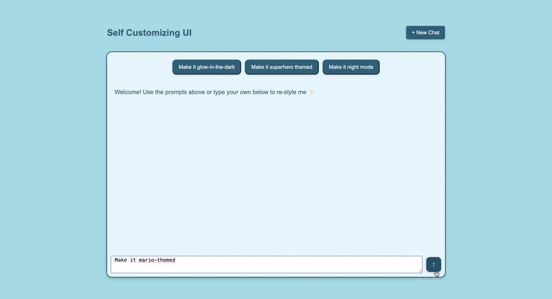

# Self Customizing UI

This AI-powered UI transforms in real-time based on what you tell it, making interface customization as simple as typing a request. Leveraging OpenAI's API, users can effortlessly customize colors, layouts, and styling elements through simple text prompts or predefined theme options. Just describe what you want-whether using the quick-access theme buttons or typing custom requests—and watch your interface magically reshape itself to match your vision!

## Features
- Dynamically update themes and styles based on user input.
- Predefined prompts for quick theme changes.
- "New Chat" button to reset the UI to default settings.

## Demo





## Setup Instructions

### Backend Setup
1. Navigate to the `backend` folder:
```
cd backend
```

2. Create a .env file in the backend folder and add your OpenAI API key:
```
OPENAI_API_KEY=your-api-key-here
```

3. Create a virtual environment:
```
python3 -m venv ai-ui-env
source ai-ui-env/bin/activate # For MacOS/Linux
ai-ui-env\Scripts\activate # For Windows
```

4. Install dependencies:
```
pip install -r requirements.txt
```

5. Run the Flask server:
```
python app.py
```

### Frontend Setup
1. Navigate to the `frontend` folder:
```
cd frontend
```

2. Open `index.html` in your browser.

### Example Prompts
- "Make it glow-in-the-dark"
- "Make it superhero themed"
- "Make it night mode"
